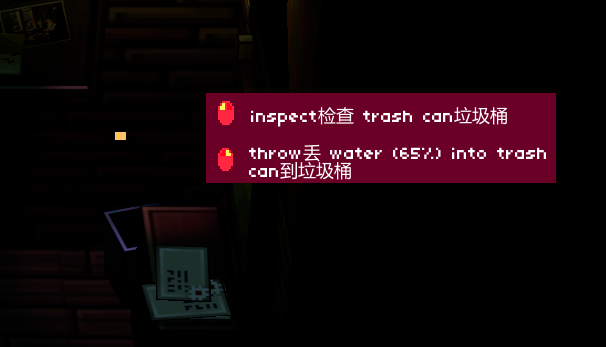
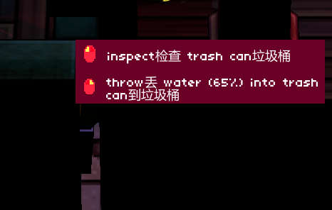
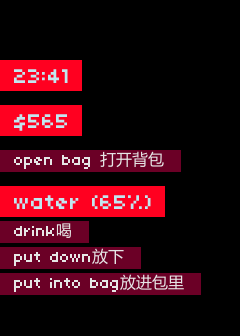

# Else Heart.Break() 汉化项目

本项目是对游戏《Else Heart.Break()》进行的深度汉化，旨在提供高质量、沉浸式的双语游戏体验。汉化内容主要分为三个部分：**游戏对话**、**UI与交互**、以及**游戏内编程脚本**。

## 如何使用翻译文件

本仓库的 `English` 目录包含了经过润色的、可直接在游戏中使用的翻译文件。所有文本均由 DeepSeek 翻译，并经过了初步校对。

**[点此下载翻译文件](https://github.com/Monika-shipship/else-heart-break-chinese/releases/download/v1.2.0/EHB_Chinese_Patch_v1.2.0.zip)** 

### 使用方法

1.  **重要：备份原始文件！**
    - **备份翻译文件**: 请找到您的游戏安装目录，在其中定位到 `ElseHeartbreak_Data\InitData\Translations\English` 文件夹。**请先将这个 `English` 文件夹完整备份到其他安全位置**。
    - **备份核心文件**: 同样地，请备份 `ElseHeartbreak_Data\Managed` 目录下的 `Assembly-CSharp.dll`, `GameWorld2.dll`, `TingTing.dll` 这三个文件。
    - **备份脚本文件**: 最后，请备份 `ElseHeartbreak_Data\InitData\Sprak` 文件夹。

2.  **替换文件**
    - **翻译对话**将本仓库中的 `English` 文件夹**覆盖**游戏目录中原有的 `ElseHeartbreak_Data\InitData\Translations\English` 文件夹。这个文件夹中的内容是负责翻译**人物对话**的
    - **翻译交互按钮**将 `UItrans_zh` 目录下的 `Assembly-CSharp.dll`, `GameWorld2.dll`, `TingTing.dll` 三个文件**覆盖**到 `ElseHeartbreak_Data\Managed` 文件夹中。这部分文件主要负责**游戏界面、物品交互和API文档**的翻译。
    - **翻译脚本** 将本仓库中的 `Sprak` 文件夹**覆盖**游戏目录中原有的 `ElseHeartbreak_Data\InitData\Sprak` 文件夹。这个文件夹中的内容是负责翻译**游戏内所有可编程对象的脚本和注释**的。

3.  **进入游戏**
    启动游戏。如果进入后未显示中文，请尝试在游戏设置中切换一下语言（例如切换到其他语言再切回来）。


## 效果展示

### 对话翻译


### 交互界面展示

这些翻译需要覆盖dll文件来实现，作者是通过 [dnSpy](https://github.com/dnSpyEx/dnSpy) 软件来实现直接编辑 dll 文本来实现的，本仓库中的翻译保留了所有的英文翻译，如果你觉得中文翻译有不妥的地方，可以直接用 [dnSpy](https://github.com/dnSpyEx/dnSpy) 搜索，直接修改即可

     

## 汉化内容详解

### 1. 游戏对话 (English 文件夹)

所有角色的对话都基于瑞典语原文，借助 DeepSeek AI 翻译为精准的“英语-中文”对照格式。为了确保翻译质量和上下文一致性，我们为每一次 AI 对话都提供了丰富的背景资料，包括：

-   **完整的剧情和人物性格分析**
-   **统一的专有名词、人名、地名术语表**

这些背景资料确保了 AI 能够理解对话发生的具体情境，从而生成更自然、更准确的译文。

<details>
<summary><strong>⚠️【剧透警告】关于背景资料来源的技术说明 (点击展开)</strong></summary>

> 本项目使用的背景信息文件（位于 `背景信息/` 目录下，如 `背景信息汇总.md`, `剧情与翻译参考详解.md`）是借助 Google Gemini 2.5 Pro 模型分析游戏全部瑞典语对话文本，并结合 Steam 社区的玩家攻略总结而成的。内容包含了对游戏世界观、角色关系和核心剧情的深入剖析。
>
> **为避免影响您的初次游戏体验，请在通关前谨慎阅读这些文件。**
>
> -   [背景信息汇总](./背景信息/背景信息汇总.md)
> -   [剧情与翻译参考详解](./背景信息/剧情与翻译参考详解.md)
> -   [专有名词与翻译对照](./背景信息/专有名词与翻译对照.md)

</details>

### 2. UI、物品与API文档 (UItrans_zh 文件夹)

游戏中的用户界面（UI）、物品名称、交互提示以及 Sprak 编程语言的 API 文档等硬编码文本，是借助强大的 .NET 反编译工具 **[dnSpyEx](https://github.com/dnSpyEx/dnSpy)** 直接编辑游戏的 `dll` 文件实现的。

**翻译难点与说明：**
由于游戏底层逻辑将“动词”和“名词”分开处理（例如 `open` 和 `door` 是两个独立的文本），为了同时保留英文原文，汉化文本采用了 `动词(中文) 名词(中文)` 的格式，例如 `open打开 door门`。这种方式虽然看起来有些冗余，但最大限度地保留了与代码相关的一致性。

> **致有能力的玩家**：如果您希望进一步优化或个性化翻译，可以同样使用 [dnSpyEx](https://github.com/dnSpyEx/dnSpy) 打开 `Assembly-CSharp.dll` 等文件。根据作者的经验，直接搜索名为 `tooltipname` 的成员，可以快速定位到大部分游戏内物品的描述文本。

### 3. 游戏内编程脚本 (Sprak 文件夹)

我们对游戏内所有 `.sprak` 脚本文件进行了全面汉化。
-   **双语注释**：为了不影响代码的正常运行，绝大部分中文翻译都以注释的形式添加在英文原文下方。
-   **Sprak 编程手册**：我们还整理了一份详尽的 Sprak 语言中文手册，汇总了所有函数、变量和基本语法，方便玩家在游戏中学习和参考。
    -   **[点此查阅 Sprak 编程手册](./背景信息/SprakManual_Full_zh.md)**

## 项目结构一览

```
.
├── English/         # 游戏对话翻译的`.eng.mtf`文件 (DeepSeek AI 润色)
├── Sprak/           # 游戏内编程脚本翻译的`.sprak`文件 (双语注释)
├── UItrans_zh/      # UI、物品、API文档翻译的`dll`文件 (dnSpy 硬编码修改)
├── 背景信息/        # 翻译过程中使用的上下文、术语表和参考资料
│   ├── SprakManual_Full_zh.md # 游戏内 Sprak 编程语言的完整中文手册
│   └── ...
├── Output/          # 打包好的发布版本
├── polish_tool/     # (开发者) 自动化翻译润色脚本
├── .gitignore       # Git 忽略文件配置
├── LICENSE          # 项目许可证
└── README.md        # 你正在阅读的这个文件
```

---
本项目提供了一套工具，用于半自动地对游戏《Else Heart.Break()》的汉化文本进行高质量润色。它利用 DeepSeek 的 API 来优化翻译文件（`.eng.mtf`）中右侧的文本，确保其格式为高质量、双语的“英文在前，中文在后”，同时保持左侧的瑞典语原文不变。

### 注意事项
- 本汉化为**英中对照**版本，以方便学习和校对。
- 由于游戏引擎的限制，过长的文本可能会在显示时被裁切。

---

## 更新日志

- **v1.2.0 (2025-11-09)**
  - **新增**: 对游戏内所有 `.sprak` 脚本文件进行了全面汉化。这包括了电脑、软盘、以及各种可编程设备的交互界面和代码注释。现在，游戏内的编程部分也实现了完整的双语体验。
  - **更新**: 使用方法中增加了关于如何安装和使用 `Sprak` 脚本汉化文件的说明。

- **v1.1.0 (2025-11-08)**
  - **新增**: 界面汉化（主界面和设置中的英文貌似是放在level文件里的，我没学会如何修改），包括游戏内交互按钮、物品名称和API文档。
  - **更新**: 使用方法现在包含覆盖 `Assembly-CSharp.dll`, `GameWorld2.dll`, `TingTing.dll` 文件的步骤。


---

## 项目来源

本仓库是在 [1PercentSync/else-heart-break-chinese](https://github.com/1PercentSync/else-heart-break-chinese) 的基础上更新而来。感谢 `1PercentSync` 的初始工作！

## 核心功能

- **双语润色**: 将译文优化为“英文-中文”格式。
- **高并发处理**: 利用线程池并行处理多行或多批次文本，最大化效率。
- **成本控制**: 支持 `batch` 模式和动态背景 (`auto` 模式) 来节约 API 调用成本。
- **可追溯性**: 为每一次翻译尝试生成详细的 JSON 日志。
- **一致性引擎**: 通过“术语挖掘”和“术语表应用”两步工作流，确保专有名词的翻译统一。
- **强大的错误处理**: 包含 API 调用重试和批量任务失败自动降级为单行重试的机制。


## 脚本工具使用方法

### 安装与配置

1.  **安装依赖**:
    ```sh
    pip install requests regex
    ```
2.  **设置 API 密钥** (环境变量 `DEEPSEEK_API_KEY`):
    -   (PowerShell): `$env:DEEPSEEK_API_KEY="你的API密钥"`
    -   (Cmd): `set DEEPSEEK_API_KEY=你的API密钥`

### 运行环境要求

**1. 确认当前目录**

**至关重要**: 所有命令都**必须**在项目的根目录（即 `else-heart-break-chinese` 文件夹）下执行。

**2. 使用 `-m` 模块化运行**

请始终使用 `python -m polish_tool.main` 的形式来运行，以避免导入错误。

### 用法示例与参数建议

#### 处理大型任务与分批运行

为安全起见，建议将大型任务分批执行。最方便的方法是使用 `--letters` 参数手动划分字母表：

- **第1批 (A-F):**
  ```sh
  python -m polish_tool.main --letters ABCDEF --mode batch
  ```
- **第2批 (G-L):**
  ```sh
  python -m polish_tool.main --letters GHIJKL --mode batch
  ```
- **后续批次以此类推...**

#### 参数设置建议 (经济性与效率)

- **追求最高性价比（推荐）**:
  ```sh
  python -m polish_tool.main --letters A --mode batch --group-size 16 --max-workers 32 --temperature 1.0
  ```
  - `--mode batch`: **必须**。节省成本的关键。
  - `--group-size 12-16`: **推荐**。平衡成本与稳定性的最佳范围。
  - `--max-workers 16-32`: **推荐**。可根据网络情况和API速率限制适当调整。
  - `--temperature 1.0`: **推荐**。最适合翻译和润色任务的温度。

- **追求最高质量 (处理核心剧情):**
  ```sh
  python -m polish_tool.main --only-files MainQuest.eng.mtf --mode batch --bg-mode full
  ```
  - `--bg-mode full`: 提供最完整的上下文，质量最高，但成本也最高。

#### 背景模式详解 (`--bg-mode`)

此参数用于平衡**翻译质量**和**API成本**。

- **`full` (完整模式)**: 发送全部三个背景文件 (`背景信息汇总.md`, `剧情与翻译参考详解.md`, `专有名词与翻译对照.md`)。质量最高，成本最高。
- **`lite` (精简模式)**: 仅发送 `专有名词与翻译对照.md`。成本最低。
- **`auto` (自动模式, 默认)**: 自动判断。如果文件名以 `_` 开头或包含 `phone`, `teach`, `siri`，则使用 `lite` 模式；否则使用 `full` 模式。

#### 术语表工作流详解 (`--mine-terms` 与 `--glossary-in`)

这两个功能是独立的，请按“先挖掘，后应用”的顺序操作。

**第一步：挖掘候选术语 (`--mine-terms`)**

此功能是“词频统计器”，用于发现潜在的专有名词。
1.  **运行**: `python -m polish_tool.main --letters ABC...Z_ --mine-terms`
2.  **得到输出**: 在 `glossary/out/.../` 目录下会生成 `glossary_candidates_...csv` 文件。
3.  **注意**: 这份文件是供您审阅的“原材料”，**不是可直接使用的三语对照表**。

**第二步：创建并应用术语表 (`--glossary-in`)**

1.  **人工审阅**: 打开 `glossary_candidates_...csv`，挑选出真正的专有名词。
2.  **创建术语表**: 新建一个您自己的 CSV 文件 (例如 `my_glossary.csv`) ，按 `source,target,tgt_lng` (瑞典语,英语,中文) 格式填入您希望强制统一的译法。
3.  **放置文件**: 将您创建的 `my_glossary.csv` 放入 `glossary/in/` 目录中。
4.  **应用**: 在后续的润色任务中，脚本会自动加载并应用此规则。

**总结：脚本不自动生成三语对照表。它通过 `--mine-terms` 提供候选词，由您来制作标准术语表，再通过 `--glossary-in` 在润色中应用。**

### 所有命令行参数

| 参数 | 默认值 | 描述 |
|---|---|---|
| `--src-dir` | `English` | 源文件目录。 |
| `--only-files` | `` | 仅处理这些文件（逗号分隔）。 |
| `--letters` | `` | 按文件首字母筛选。**不区分大小写，不支持范围(如A-G)**。 |
| `--max-workers` | `16` | 并行线程数。 |
| `--timeout` | `90` | HTTP 请求超时（秒）。 |
| `--temperature`| `1.0`| 采样温度。 |
| `--max-tokens`| `400`| 单行回复最大 tokens。 |
| `--mode` | `batch` | `line` (单行) 或 `batch` (批量)。 |
| `--group-size`| `12` | batch 模式的批大小。 |
| `--bg-mode` | `auto` | `full`, `lite`, 或 `auto`。 |
| `--dry-run` | `False` | 仅统计文件，不执行操作。 |
| `--log-dir` | `logs/deepseek` | 日志输出目录。 |
| `--progress-interval`| `5.0`| 进度更新间隔（秒）。 |
| `--glossary-in` | `glossary/in`| 术语表输入目录。 |
| `--glossary-out`| `glossary/out`| 术语表输出目录。 |
| `--mine-terms`| `False` | 启用术语挖掘。 |


